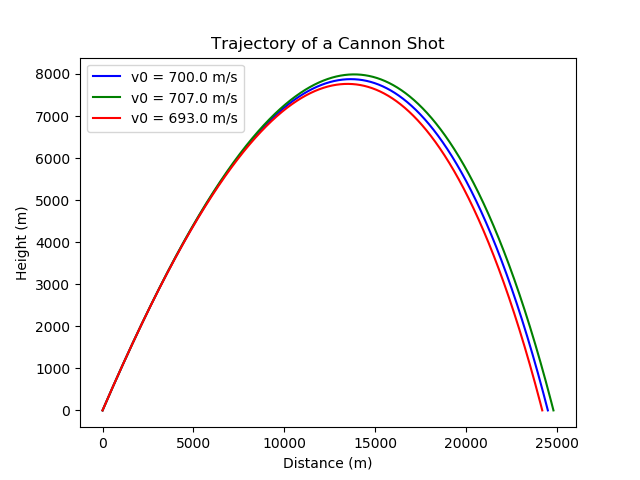
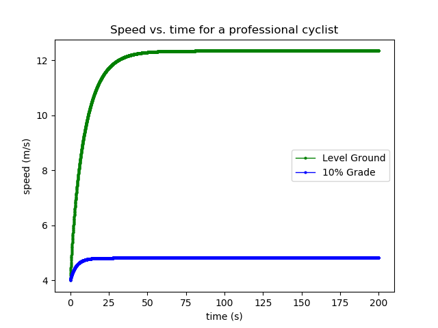
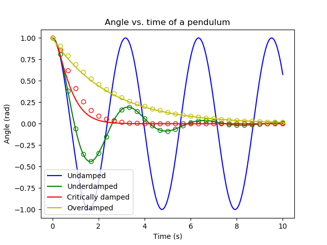
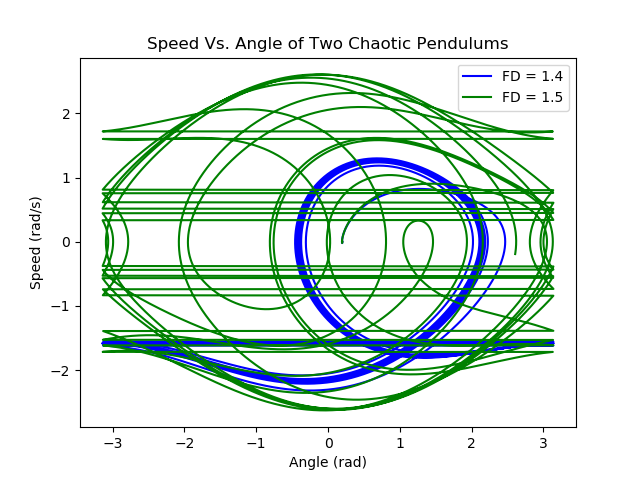
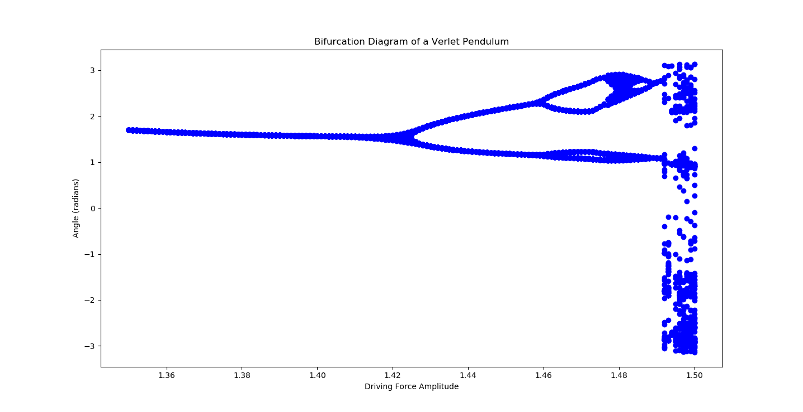

# Computational Physics Simulators: A2

This was Assignment 2 of a computational physics course in my second year of university. It consisted of scripting calculations within Python, using algorithms that we had been working on during our coursework.

Numpy was used heavily here, as was matplotlib. The precise algorithm is the Euler method, which is used to calculate how an object behaves in the future, given information about its present - or more accurately, how it behaves in the present, given information about its recent past.

I wouldn't change much about these programs if I were to go over them again - they successfully did what I created them to do, after all - but I would improve the documentation. As it stands, the comments are geared towards someone from a more technical background than myself - as I was writing them for the audience of my professor, or the grad student marking my assignments - but given a few years' experience, I can appreciate having more comments to clarify things further without resorting to a technical background similar to my own.

The scripts can be run with any Python 3 interpreter. The Matplotlib and Numpy packages are required.

# Computational Physics Simulators: A4

For transparency, the whole assignment has been included, but the files of note here are a4q3.py, a4q4.py, and a4q4lib.py.

This assignment focuses on the motion of a pendulum using the Euler-Cromer algorithm. It makes use of Python functions and numpy as well.

If I were to redo these scripts with more time, I would provide better documentation than I did.

The program can be compiled and run using any Python 3 interpreter. The Numpy package is required.

# Computational Physics Simulators: A5

This program was created to simulate a pendulum - much like A4, also in this portfolio - except this program uses a much more accurate method, the Verlet algorithm.

This program makes heavy use of the Numpy package for calculations and data storage.

Though it does its job, if I were to redo this program I would place better documentation within it - as it stands it assumes the reader has a technical background, which was fine at the time but now it is no longer a given.

To run the programs, any Python 3 interpreter can be used. The Numpy and Matplotlib packages are required.

# Gallery
See below some of the more important figures from the simulators.

Figure 1: From A2, a chart of the investigation of different initial speeds to a simulated projectile. See also the folder "A2 dt determination figures", which consist of a handful of test charts cimilar to this one used when determining the resolution of my simulation.

Figure 2: From A2, a chart showing the effect of a slope on a simulated bicyclist's speed.

Figure 3: From A4Q3, a chart showing the effects of different pendulum damping. The dots on the chart represent the solutions found using numerical methods, while the lines represent solutions found via exact methods (i.e, a mathematical function). Within the same folder are figures showing error in two different methods and introducing a driving force into the system.

Figure 4: From A4Q4, a chart showing the paths of two pendulums in "chaos" - when the pendulum's path does not follow a simple harmonic function. The chart is flawed due to horizontal lines appearing when the angle is changed from -π to +π or vice versa, but the primary information I had been looking for - the pendulums' paths - remain somewhat legible. Also in the A4Q4 figures folder is a chart showing the angle as a function of time.

Figure 5: From A5, a bifurcation diagram which shows the path of a pendulum as its driving force increases. The data is strobed at regular intervals - like a regular camera flash in a dark room, or a video game being displayed at a low framerate. Of note is the cloudy region on the far right as the pendulum goes from normal behaviour to chaos, and its path becomes irregular.
